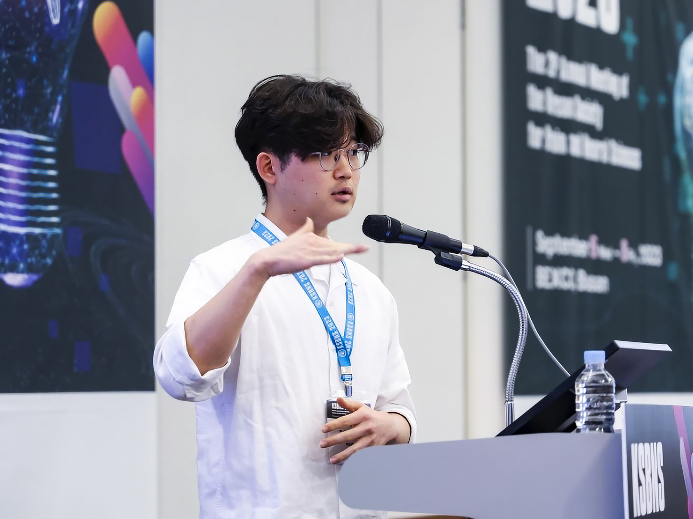

# Yehhyun Jo

{: style="width:460px; float:right; margin-left:20px; border-radius:5px;" }

Curriculum Vitae

Ph.D. Candidate, KAIST School of Electrical Engineering  

Email: yehhyunjo18@kaist.ac.kr  
[LinkedIn](https://www.linkedin.com/in/yehhyun-jo-01654924a)

---
Hi, I’m Yehhyun, a biomedical engineering researcher with a focus on low-intensity focused ultrasound (LIFU) stimulation for therapeutics. I’m currently a PhD student at KAIST advised by Hyunjoo Jenny Lee PhD, where I’m building tools and techniques that bridge neural engineering, imaging, and therapeutics.

My research explores how we can noninvasively stimulate specific neural circuits using ultrasound. I design closed-loop systems that combine electrophysiology, calcium imaging, and genetic tools to precisely map and modulate brain activity in real time.

If you’re interested in neuromodulation, mechanotransduction, or collaborative tool development for neuroscience, feel free to get in touch.

---

**Education**

**M.S. in Electrical Engineering** — KAIST, 2022  
Thesis: *Transcranial ultrasound stimulation for sleep and memory modulation in freely-moving mice*

**B.S. in Electrical Engineering** — KAIST, 2020  
Minor in Science and Technology Policy

---

**Visiting**

**Institute for Basic Science**, Center for Cognition and Sociality  
*Student Researcher*, Spring 2024 - Spring 2026  
Advisor: Joo-Min Park Ph.D.

**Stanford University**, Department of Electrical Engineering  
*Visiting Student Researcher*, Fall 2024 – Spring 2025  
Advisor: Hyongsok Tom Soh Ph.D.

---
🌐 **[All publications - Google Scholar](https://scholar.google.com/citations?user=Zamd4igAAAAJ&hl=en)**

**Selected publications**

1. **Yehhyun Jo**, Subeen Kim, Jinseong Jeong, and Hyunjoo Jenny Lee.  
   **"Ultrasound brain stimulation technologies for targeted therapeutics."** *Nature Electronics*, Accepted.

2. **Yehhyun Jo†**, Xiaojia Liang†, et al.  
   **"Selective manipulation of excitatory and inhibitory neurons in top-down and bottom-up visual pathways using ultrasound stimulation of corticothalamic regions."** *Brain Stimulation*, 2025.

3. Subeen Kim†, **Yehhyun Jo†**, et al.  
   **"Miniaturized MR-compatible ultrasound system for real-time monitoring of acoustic effects in mice using high-resolution MRI."** *NeuroImage*, 2023.

4. **Yehhyun Jo**, Sang-Mok Lee, et al.  
   **"General‐Purpose Ultrasound Neuromodulation System for Chronic, Closed‐Loop Preclinical Studies in Freely Behaving Rodents."** *Advanced Science*, 2022.

5. Seongyeon Kim†, **Yehhyun Jo†**, et al.  
   **"Transcranial focused ultrasound stimulation with high spatial resolution."** *Brain Stimulation*, 2021.

---

**Honors & Awards**

- **Hanchulhee Augustino Scholarship**, KAIST EE, Spring 2024  
- **Top 10 Research Achievements**, KAIST, 2022  
- **Frontispiece Paper**, *Advanced Science*, 2022  
- **Cover Article**, *Brain Stimulation*, 2021  
- **Grand Prize**, KAIST URP Program, 2018–2019

---

**Conferences**

- IEEE MEMS, Taiwan, 2025  
- KSBNS Conference, Gyeongju, Korea, 2024  
- ‘Young Scientist’ Minisymposium, KSBNS, Busan, Korea, 2023  
- MRS Spring Meeting, Honolulu, USA, 2022  
- IEEE EMBS NER, Virtual, 2021
- IEEE MEMS, Vancouver, Canada, 2020
- IEEE EMBC, Berlin, Germany, 2019

---

**Patents**

- **Ultrasonic holography device**, KR Patent No. 10-2283276  
- **3D electrophysiology recording apparatus**, KR Patent No. 10-2326160, US Pending

---

**Journal review**

- NPJ Acoustics, 2025
- Journal of NeuroEngineering and Rehabilitation, 2025
- Journal of Nanobiotechnology, 2024
- Scientific Reports, 2024

---
