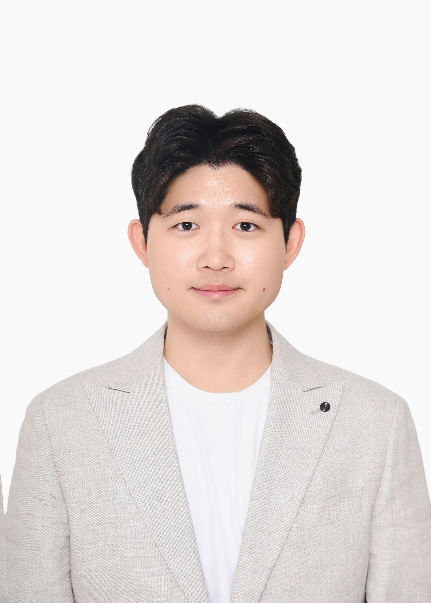
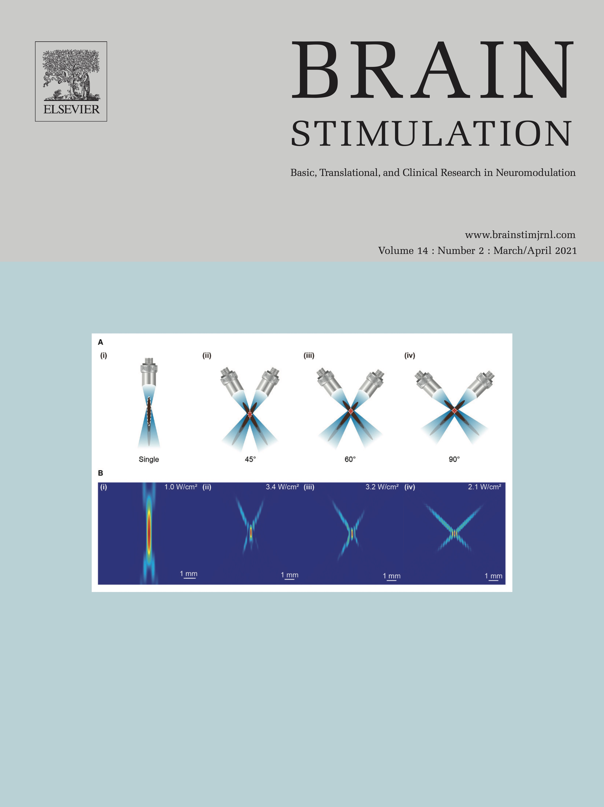
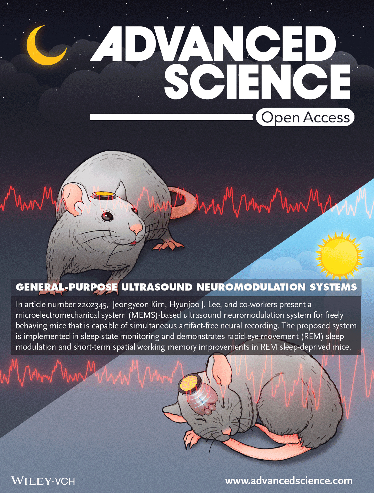
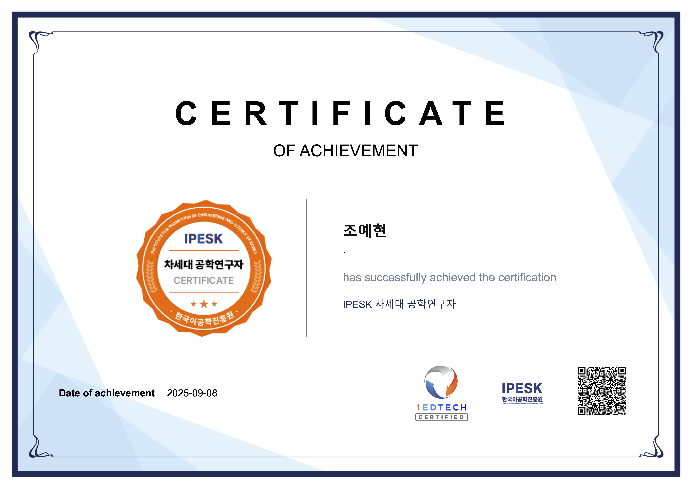
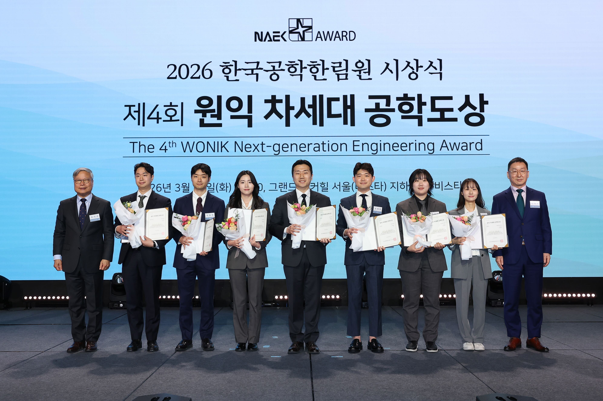
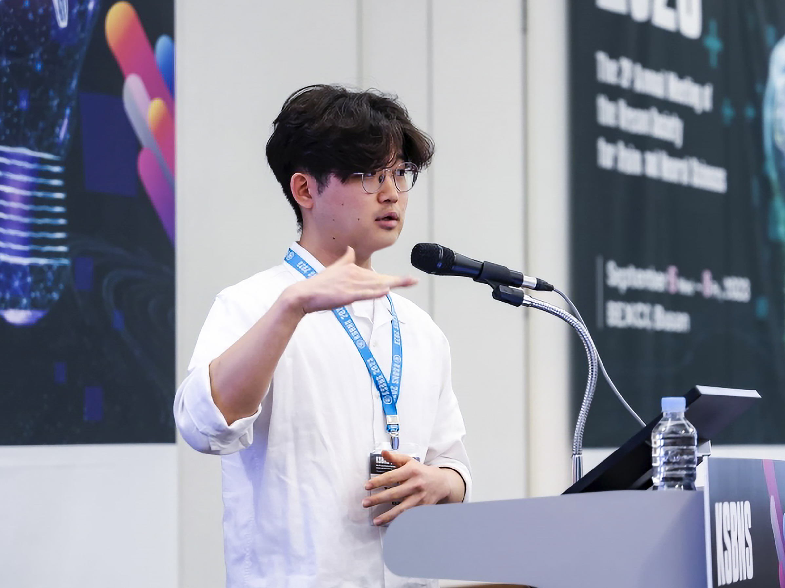

# Yehhyun Jo

{: style="width:200px; float:right; margin-left:20px; border-radius:1px;" }

Curriculum Vitae

**Postdoctoral researcher**

**Center for Memory and Glioscience, Institute for Basic Science (IBS)**    

Advisor: Joo-Min Park Ph.D.

Center Director: Justin C. Lee Ph.D.

Email: yehhyunjo18@gmail.com
[LinkedIn](https://www.linkedin.com/in/yehhyun-jo-01654924a)  

---
Hi, I’m Yehhyun, a biomedical engineer and neuroscientist working on low-intensity focused ultrasound (LIFU) stimulation for glioscience-driven therapeutics. I completed my Ph.D. at KAIST under the supervision of Professor Jenny Lee with a focus on developing novel ultrasound stimulation neurotools for integration with biological readout techniques such as MRI, EEG, and calcium imaging. I’m currently a postdoctoral researcher at the Center for Memory and Glioscience at the Institute for Basic Science (IBS), where I’m conducting fundamental research on the mechanobiology of neuro-glio-vascular dynamics through the mechanism of ultrasound stimulation. 

My research explores how we can noninvasively stimulate specific neural circuits, and modulate mechanosensitivity in the CNS and PNS using low-intensity focused ultrasound. I design closed-loop systems that combine electrophysiology, calcium imaging, and genetic tools to precisely map and modulate brain activity in real time.

If you’re interested in neuromodulation, mechanobiology, mechanotransduction, or collaborative tool development for neuroscience, feel free to get in touch.

---

**Education**

**Ph.D. in Electrical Engineering** — KAIST, 2026  
Thesis: *Ultrasound brain stimulation technologies and monitoring systems for targeted therapeutics*  
Advisor: Hyunjoo Jenny Lee Ph.D.

**M.S. in Electrical Engineering** — KAIST, 2022  
Thesis: *Transcranial ultrasound stimulation for sleep and memory modulation in freely-moving mice*  
Advisor: Hyunjoo Jenny Lee Ph.D.

**B.S. in Electrical Engineering** — KAIST, 2020  
Minor in Science and Technology Policy

---

**Visiting**

**Institute for Basic Science**, Center for Memory and Glioscience  
*Visiting Researcher*, Spring 2024 - Spring 2026  
Advisor: Joo-Min Park Ph.D.

**Stanford University**, Department of Electrical Engineering  
*Visiting Student Researcher*, Fall 2024 – Spring 2025  
Advisor: Hyongsok Tom Soh Ph.D.

---
🌐 **[All publications - Google Scholar](https://scholar.google.com/citations?user=Zamd4igAAAAJ&hl=en)**

**Selected publications**

1. **Yehhyun Jo**, Subeen Kim, Jinseong Jeong, and Hyunjoo Jenny Lee.  
   **"Ultrasound brain stimulation technologies for targeted therapeutics."** *Nature Electronics*, 2025.

2. **Yehhyun Jo†**, Xiaojia Liang†, et al.  
   **"Selective manipulation of excitatory and inhibitory neurons in top-down and bottom-up visual pathways using ultrasound stimulation of corticothalamic regions."** *Brain Stimulation*, 2025.

3. Subeen Kim†, **Yehhyun Jo†**, et al.  
   **"Miniaturized MR-compatible ultrasound system for real-time monitoring of acoustic effects in mice using high-resolution MRI."** *NeuroImage*, 2023.

4. **Yehhyun Jo**, Sang-Mok Lee, et al.  
   **"General‐Purpose Ultrasound Neuromodulation System for Chronic, Closed‐Loop Preclinical Studies in Freely Behaving Rodents."** *Advanced Science*, 2022.

5. Seongyeon Kim†, **Yehhyun Jo†**, et al.  
   **"Transcranial focused ultrasound stimulation with high spatial resolution."** *Brain Stimulation*, 2021.

---

{: style="height:180px; float:right; margin-left:20px; border-radius:1px;" }
{: style="height:180px; float:right; margin-left:20px; border-radius:1px;" }
{: style="height:180px; float:right; margin-left:20px; border-radius:1px;" }
{: style="height:180px; float:right; margin-left:20px; border-radius:1px;" }
  
**Honors & Awards**  

- **WONIK Next-generation engineering award**, National Academy of Engineering of Korea (NAEK), 2026
- **Selected as a "next-generation" researcher**, Institute for Promotion of Engineering and Science of Korea (IPESK), 2025
- **Hanchulhee Augustino Scholarship**, KAIST EE, Spring 2024  
- **Top 10 Research Achievements**, KAIST, 2022  
- **Frontispiece Paper**, *Advanced Science*, 2022  
- **Cover Article**, *Brain Stimulation*, 2021  
- **Grand Prize**, KAIST URP Program, 2018–2019  

---

{: style="width:320px; float:right; margin-left:20px; border-radius:1px;" }

**Conferences**

- Focused Ultrasound Neuromodulation (FUN) Conference, Hong Kong, 2025
- IEEE MEMS, Kaohsiung, Taiwan, 2025  
- KSBNS Conference, Gyeongju, Korea, 2024  
- ‘Young Scientist’ Minisymposium, KSBNS Conference, Busan, Korea, 2023  
- MRS Spring Meeting, Honolulu, Hawaii, USA, 2022  
- IEEE EMBS NER, Virtual, 2021  
- IEEE MEMS, Vancouver, Canada, 2020  
- IEEE EMBC, Berlin, Germany, 2019  

---

**Patents**

- **Ultrasonic holography device**, KR Patent No. 10-2283276  
- **3D electrophysiology recording apparatus**, KR Patent No. 10-2326160, US Pending

---

**Reviewer work**

- Translational Psychiatry, 2026
- IEEE Open Journal of UFFC, 2025
- NPJ Acoustics, 2025
- Journal of NeuroEngineering and Rehabilitation, 2025
- Journal of Nanobiotechnology, 2024
- Scientific Reports, 2024

---
